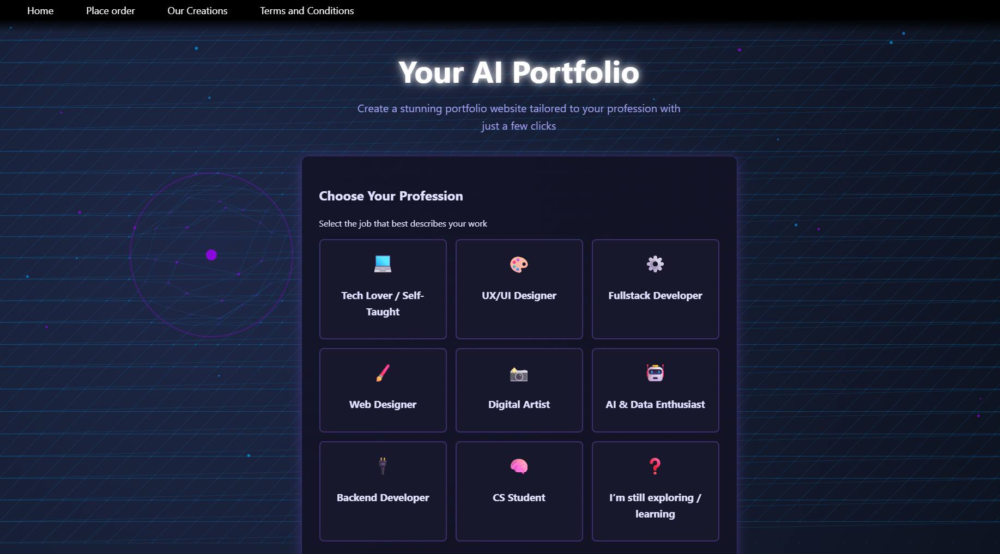

# smartfolio

Smartfolio est un SaaS qui automatise la création de CV numériques personnalisés pour les développeurs et les étudiants en informatique. Ce dépot open-source propose la vitrine web historique ainsi qu'un backend Flask minimal permettant de parcourir l'interface sans connecter les services propriétaires.




## Contenu

- Frontend complet (gabarits HTML, CSS, JS) provenant de l'application originale.
- Backend Flask reduit (`main.py`) avec des réponses factices afin de conserver les parcours utilisateurs.
- Deux captures (`templates/portfolio_landing.png` et `templates/portfolio_example.png`) illustrent la page d'accueil et un exemple du produit géneré.
- TikTok: [@smartfolio.ai](https://www.tiktok.com/@smartfolio.ai)

## Exemple d'un portfolio généré sur mesure


## Demarrage rapide

```bash
python -m venv .venv
.venv\Scripts\activate  # Windows
pip install -r requirements.txt
set STATIC_WEBSITE_PASSWORD=demo  # facultatif : changez le mot de passe de la demo
python main.py
```

Ensuite, ouvrez http://localhost:5000 dans votre navigateur et connectez-vous avec n'importe quel nom d'entreprise et le mot de passe defini (par defaut `demo`).

## Personnalisation

- `STATIC_WEBSITE_PASSWORD` permet de fixer un mot de passe simple pour la version deployee.
- `STATIC_WEBSITE_SECRET` vous laisse definir une cle secrete Flask personnalisee (sinon valeur par defaut `change-me` utilisee).
- Les assets se trouvent dans `static/` et les gabarits dans `templates/`.

Les intégrations IA et automations ont ete retirées pour éviter toute fuite de cles ou de données sensibles. Vous pouvez reconnecter vos propres services en ajoutant vos endpoints dans `main.py`.

## Etat du projet

La plateforme n'est plus hébergée aujourd'hui, mais la présence en ligne continue via TikTok (@smartfolio.ai). Ce dépot sert de reference pour toute relance ou reutilisation future.
